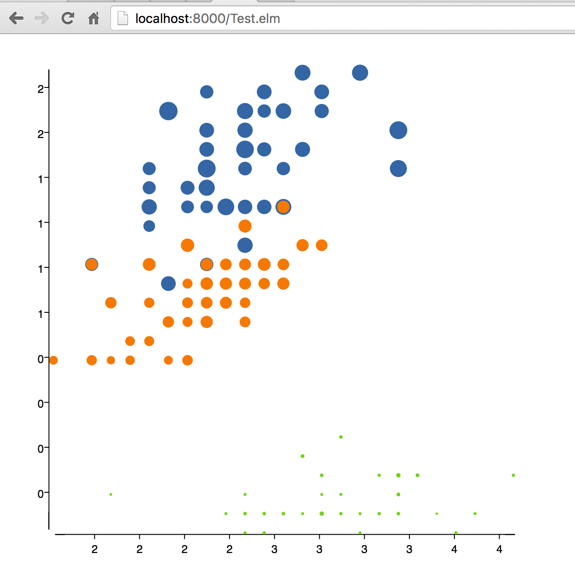

# elm-vega

Trying to bring the nice declarative visualization abstraction of [Vega](https://vega.github.io/) to Elm as a DSL, so we can leverage Elm's language infrastructure, including:

- Infrastructure for interactivity (The Elm Architecture)
- The typechecker for validation, and types as documentation

Currently as far as rendering this scatterplot of the Iris example dataset:

Axis rendering needs a lot of work. Also more marks, etc. Interactivity & selections haven't been started yet.

Currently builds on top of [vilterp/elm-diagrams](https://github.com/vilterp/elm-diagrams), which renders to `Collage` from [evancz/elm-graphics](https://github.com/evancz/elm-graphics), which renders to `<canvas>`.